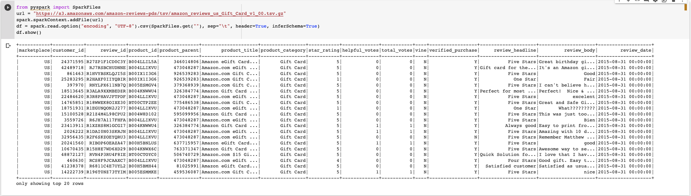
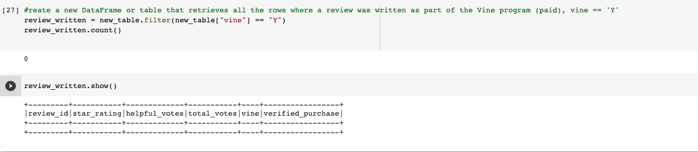
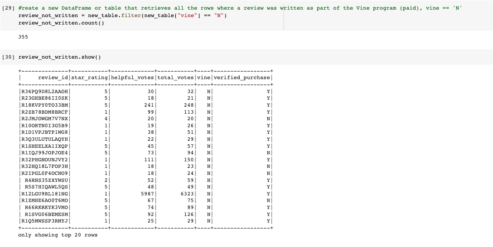
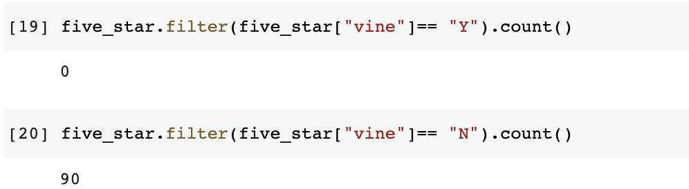
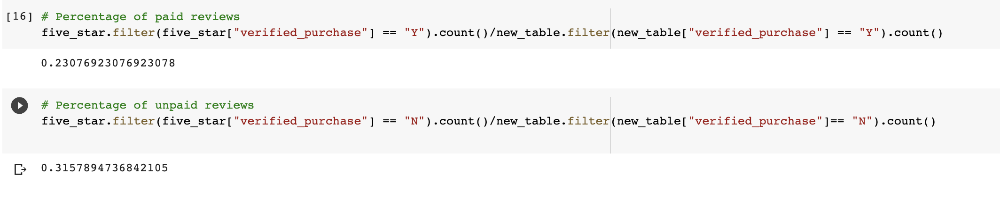

# Amazon Vine Analysis

### Overview of the analysis:

For this project, we will select a dataset from Amazon reviews of [gift card](https://s3.amazonaws.com/amazon-reviews-pds/tsv/amazon_reviews_us_Gift_Card_v1_00.tsv.gz), run the ETL process using Pyspark, extract the data, transform the data, and connect it to the generated database via an AWS web server. became. I would like to use ratings to determine if there is a positive rating bias for her Vine members in the dataset. 

___

## Results:

### How many Vine reviews and non-Vine reviews were there?
. The number of customers who write reviews is 0

. The number of customers who did not write reviews is   355

### How many Vine reviews were 5 stars? How many non-Vine reviews were 5 stars?
. There were 0 vine reiews and 90 non-vine reviews

### What percentage of Vine reviews were 5 stars? What percentage of non-Vine reviews were 5 stars?
23% of the five_star reviews were vine
31.5% of the five_star reviews were non-vine

___

## Summary :

According to the data, 23% of the five-star reviews were left by Vine reviewers, meaning that they received the product or service for free in exchange for their review. On the other hand, 31.5% of the five-star reviews were left by non-Vine reviewers, who purchased the product or service themselves.

This suggests that the product or service is perceived positively by both groups, with a higher proportion of non-Vine reviewers leaving five-star reviews compared to Vine reviewers. However, it is worth noting that the sample size of Vine reviewers may be smaller, given that the Vine program is generally limited to a smaller number of reviewers.

Overall, the data indicates that the product or service has received positive reviews from both Vine and non-Vine reviewers, which can be a good sign for potential customers who are considering purchasing it. However, it is important to consider other factors such as the total number of reviews, the overall rating, and the content of the reviews before making a final decision.
